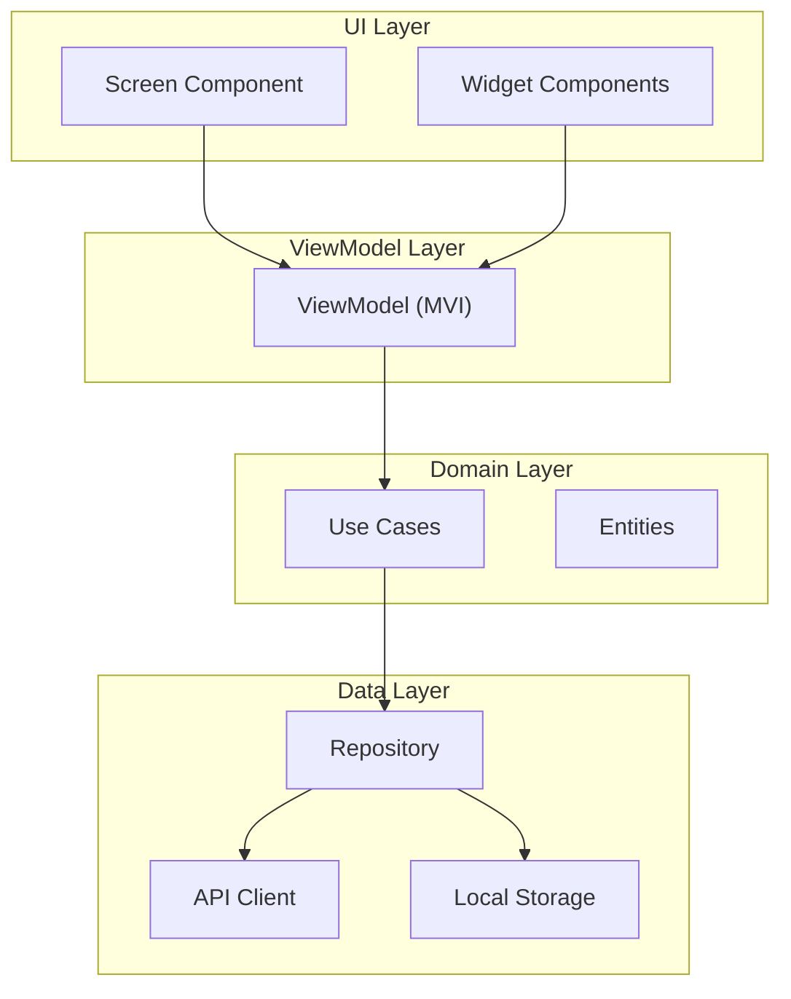

# Technical Design — {Epic Name}

## Table of Contents

<!-- toc -->

<!-- /toc -->

## 1. Epic Overview

### 1.1 Purpose

{1-2 paragraphs: What this screen/flow/capability provides, what user needs it addresses.}

**Parent MiniApp Design**: [../DESIGN.md](../DESIGN.md)

### 1.2 Requirements Coverage

| Requirement ID | Requirement | Design Response |
|----------------|-------------|-----------------|
| `cpt-{miniapp}-epic-{epic}-fr-{slug}` | {Requirement description} | {How this design addresses it} |

### 1.3 Architecture Drivers

**ADRs**: `cpt-{miniapp}-adr-{slug}`

## 2. Component Architecture

### 2.1 Component Diagram

- [ ] `p1` - **ID**: `cpt-{miniapp}-epic-{epic}-component-overview`



### 2.2 Screen Components

#### {Screen Name}

- [ ] `p1` - **ID**: `cpt-{miniapp}-{epic}-screen-{slug}`

**Responsibility**: {What this screen does}

**Platform Implementation:**

| Platform | Component | Location |
|----------|-----------|----------|
| KMP | `{Epic}ViewModel` | `constructor-sdk/feature/{miniapp}/presentation/{epic}/` |
| Android | `{Epic}Screen` | `android-app/feature/{miniapp}/ui/{epic}/` |
| iOS | `{Epic}View` | `ios-app/Features/{MiniApp}/Views/{Epic}/` |

### 2.3 Widget Components

#### {Widget Name}

- [ ] `p2` - **ID**: `cpt-{miniapp}-{epic}-widget-{slug}`

**Responsibility**: {What this widget does}

**States**: {default, loading, error, empty, success}

**Props/Parameters:**
- `{prop1}`: {type} — {description}
- `{prop2}`: {type} — {description}

## 3. State Management

### 3.1 Screen State

- [ ] `p1` - **ID**: `cpt-{miniapp}-{epic}-state`

```kotlin
data class {Epic}State(
    val screenState: ScreenState = ScreenState.Loading,
    val {field1}: {Type} = {default},
    val {field2}: {Type} = {default},
)

sealed class ScreenState {
    object Loading : ScreenState()
    data class Content(val data: {DataType}) : ScreenState()
    data class Error(val message: String) : ScreenState()
}
```

### 3.2 User Intents

```kotlin
sealed class {Epic}Intent {
    object LoadData : {Epic}Intent()
    data class OnItemClick(val id: String) : {Epic}Intent()
    data class OnInputChange(val value: String) : {Epic}Intent()
    object OnSubmit : {Epic}Intent()
    object OnRefresh : {Epic}Intent()
}
```

### 3.3 Side Effects

```kotlin
sealed class {Epic}Effect {
    data class Navigate(val route: String) : {Epic}Effect()
    data class ShowSnackbar(val message: String) : {Epic}Effect()
    data class ShowDialog(val config: DialogConfig) : {Epic}Effect()
}
```

## 4. Data Flow

### 4.1 Use Cases

#### {Use Case Name}

- [ ] `p1` - **ID**: `cpt-{miniapp}-{epic}-usecase-{slug}`

**Input**: `{InputType}`

**Output**: `Result<{OutputType}>`

**Steps**:
1. Validate input
2. Call repository
3. Transform result
4. Return

```kotlin
class {UseCase}UseCase(
    private val repository: {Repository}
) {
    suspend operator fun invoke(input: {InputType}): Result<{OutputType}> {
        // Implementation
    }
}
```

### 4.2 Repository Operations

- [ ] `p1` - **ID**: `cpt-{miniapp}-{epic}-repo-{slug}`

| Operation | Method | Source | Caching |
|-----------|--------|--------|---------|
| Get list | `getItems()` | API + Local | Cache-first |
| Get item | `getItem(id)` | API | No cache |
| Save item | `saveItem(item)` | API → Local | Write-through |

### 4.3 API Contracts

- [ ] `p2` - **ID**: `cpt-{miniapp}-{epic}-api-{slug}`

| Method | Endpoint | Request | Response |
|--------|----------|---------|----------|
| `GET` | `/api/v1/mobile/{miniapp}/{epic}` | — | `{ResponseDTO}` |
| `POST` | `/api/v1/mobile/{miniapp}/{epic}` | `{RequestDTO}` | `{ResponseDTO}` |

## 5. Navigation

### 5.1 Screen Navigation

- [ ] `p2` - **ID**: `cpt-{miniapp}-{epic}-nav`

**Entry Points:**
- From: {Previous screen} via {action}
- Deep link: `constructor://{miniapp}/{epic}?{params}`

**Exit Points:**
- To: {Next screen} via {action}
- Back: {Previous screen}

### 5.2 Navigation Parameters

| Parameter | Type | Required | Description |
|-----------|------|----------|-------------|
| `{param1}` | String | Yes | {Description} |
| `{param2}` | Int | No | {Description} |

## 6. Platform-Specific Considerations

### 6.1 Android

- [ ] `p2` - **ID**: `cpt-{miniapp}-{epic}-android`

**Compose Specifics:**
- {Compose-specific implementation notes}

**Lifecycle Handling:**
- {How screen handles configuration changes}

### 6.2 iOS

- [ ] `p2` - **ID**: `cpt-{miniapp}-{epic}-ios`

**SwiftUI Specifics:**
- {SwiftUI-specific implementation notes}

**Lifecycle Handling:**
- {How view handles scene phases}

### 6.3 WebView Integration

{If this epic uses WebView}

- [ ] `p2` - **ID**: `cpt-{miniapp}-{epic}-webview`

**WebView URL**: `{webview-base-url}/{path}`

**JS Bridge Methods:**
- `{method1}(params)`: {Description}
- `{method2}(params)`: {Description}

**Native → WebView Events:**
- `{event1}`: {When triggered}

**WebView → Native Events:**
- `{event1}`: {What it triggers}

## 7. Error Handling

### 7.1 Error States

| Error Type | UI Response | Recovery Action |
|------------|-------------|-----------------|
| Network error | Show error screen with retry | Retry button |
| Auth error | Navigate to login | Re-authenticate |
| Validation error | Show inline error | Fix input |
| Server error | Show error snackbar | Retry or contact support |

### 7.2 Offline Behavior

- [ ] `p2` - **ID**: `cpt-{miniapp}-{epic}-offline`

**Offline Capable**: Yes / No

**Offline Behavior:**
- Read: {How read operations work offline}
- Write: {How write operations are queued}
- Sync: {How data syncs when online}

## 8. Traceability

- **Epic PRD**: [PRD.md](./PRD.md)
- **MiniApp DESIGN**: [../DESIGN.md](../DESIGN.md)
- **ADRs**: [adr/](./adr/)
- **DECOMPOSITION**: [DECOMPOSITION.md](./DECOMPOSITION.md)
- **Features**: [features/](./features/)
