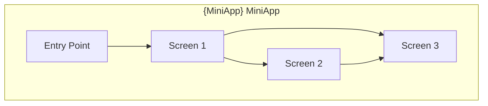
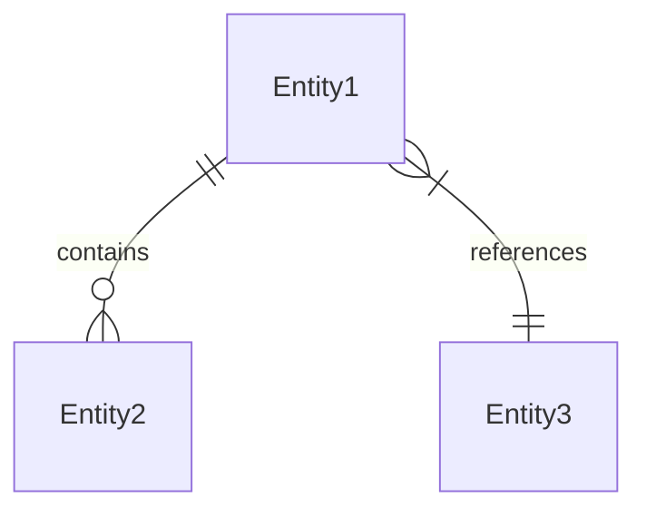

# Technical Design — {MiniApp Name} MiniApp

## Table of Contents

<!-- toc -->

<!-- /toc -->

## 1. MiniApp Overview

### 1.1 Purpose

{1-2 paragraphs: What this MiniApp provides, what user problems it solves, how it fits into the SuperApp ecosystem.}

**Parent Platform Design**: [../DESIGN.md](../DESIGN.md)

### 1.2 Capabilities

Capabilities from MiniApp PRD with design allocation:

| Capability ID | Capability | Design Response |
|---------------|------------|-----------------|
| `cpt-{miniapp}-fr-{slug}` | {Capability description} | {How MiniApp architecture addresses this} |

### 1.3 Architecture Drivers

**ADRs**: `cpt-{miniapp}-adr-{slug}`

#### NFR Allocation

| NFR ID | NFR Summary | Allocated To | Design Response |
|--------|-------------|--------------|-----------------|
| `cpt-{miniapp}-nfr-{slug}` | {Brief NFR description} | {Module/component} | {How this design element realizes the NFR} |

## 2. Module Structure

### 2.1 Module Overview

```
{miniapp}/
├── constructor-sdk/feature/{miniapp}/     # KMP Shared Logic
│   ├── domain/                            # Domain entities
│   ├── data/                              # Repository implementations
│   └── presentation/                      # ViewModels (MVI)
│
├── android-app/feature/{miniapp}/          # Android UI
│   ├── ui/                                # Compose components
│   └── navigation/                        # Navigation graph
│
└── ios-app/Features/{MiniApp}/             # iOS UI
    ├── Views/                             # SwiftUI views
    └── Navigation/                        # Coordinators
```

### 2.2 KMP Modules

- [ ] `p1` - **ID**: `cpt-{miniapp}-component-kmp-domain`

#### Domain Module

**Location**: `constructor-sdk/feature/{miniapp}/domain/`

**Responsibility**: Core business entities and rules for {MiniApp}

**Contains**:
- Domain entities
- Repository interfaces
- Use case definitions

#### Data Module

- [ ] `p1` - **ID**: `cpt-{miniapp}-component-kmp-data`

**Location**: `constructor-sdk/feature/{miniapp}/data/`

**Responsibility**: Data layer implementation

**Contains**:
- Repository implementations
- API clients
- Local data sources
- DTOs and mappers

#### Presentation Module

- [ ] `p1` - **ID**: `cpt-{miniapp}-component-kmp-presentation`

**Location**: `constructor-sdk/feature/{miniapp}/presentation/`

**Responsibility**: State management (MVI pattern)

**Contains**:
- ViewModels
- UI State classes
- UI Events
- Side Effects

### 2.3 Android Modules

- [ ] `p1` - **ID**: `cpt-{miniapp}-component-android-ui`

**Location**: `android-app/feature/{miniapp}/`

**Responsibility**: Android-specific UI implementation

**Contains**:
- Jetpack Compose screens
- Compose components
- Navigation graph
- Android-specific resources

**Dependencies**:
- `constructor-sdk/feature/{miniapp}` (KMP shared)
- `android-app/common/ui` (design system)
- `android-app/common/navigation`

### 2.4 iOS Modules

- [ ] `p1` - **ID**: `cpt-{miniapp}-component-ios-ui`

**Location**: `ios-app/Features/{MiniApp}/`

**Responsibility**: iOS-specific UI implementation

**Contains**:
- SwiftUI views
- View components
- Navigation coordinators
- iOS-specific resources

**Dependencies**:
- `ConstructorSDK` (KMP framework)
- `ios-app/Common/UI` (design system)
- `ios-app/Common/Navigation`

## 3. Navigation Architecture

### 3.1 Navigation Graph

- [ ] `p2` - **ID**: `cpt-{miniapp}-component-navigation`



**Screen Inventory:**

| Screen | Route | Description | Implementation |
|--------|-------|-------------|----------------|
| {Screen1} | `/{miniapp}/{screen1}` | {Description} | Native / WebView |
| {Screen2} | `/{miniapp}/{screen2}` | {Description} | Native / WebView |

### 3.2 Deep Links

- [ ] `p2` - **ID**: `cpt-{miniapp}-deeplink-schema`

| Deep Link | Target Screen | Parameters |
|-----------|---------------|------------|
| `constructor://{miniapp}/{path}` | {Screen} | `{param1}`, `{param2}` |

**Deep Link Handling Flow:**

1. Host app receives deep link
2. MiniApp Registry routes to {MiniApp}
3. {MiniApp} navigation handles internal routing
4. Target screen displayed with parameters

## 4. State Management

### 4.1 MVI Pattern

- [ ] `p1` - **ID**: `cpt-{miniapp}-principle-mvi`

```
┌──────────────────────────────────────────────────────────────┐
│                        VIEW (UI)                              │
│  ┌────────────────┐          ┌────────────────┐              │
│  │  Compose/SwiftUI│  ←state─ │    State       │              │
│  │     Screen     │          │   (immutable)  │              │
│  └───────┬────────┘          └────────────────┘              │
│          │ intent                    ↑                        │
│          ↓                           │                        │
│  ┌────────────────────────────────────────────────────────┐  │
│  │                    VIEWMODEL                            │  │
│  │   Intent → Reducer → State                              │  │
│  │                ↓                                        │  │
│  │          Side Effects → Repository                      │  │
│  └────────────────────────────────────────────────────────┘  │
└──────────────────────────────────────────────────────────────┘
```

**State Structure:**

```kotlin
data class {MiniApp}State(
    val isLoading: Boolean = false,
    val data: List<{Entity}> = emptyList(),
    val error: String? = null,
    // MiniApp-specific state fields
)

sealed class {MiniApp}Intent {
    object Load : {MiniApp}Intent()
    data class Select(val id: String) : {MiniApp}Intent()
    // MiniApp-specific intents
}

sealed class {MiniApp}Effect {
    data class Navigate(val route: String) : {MiniApp}Effect()
    data class ShowError(val message: String) : {MiniApp}Effect()
    // MiniApp-specific side effects
}
```

### 4.2 State Persistence

- [ ] `p2` - **ID**: `cpt-{miniapp}-component-state-persistence`

**Persisted State:**
- {List state that needs persistence}

**Transient State:**
- {List state that is not persisted}

**Persistence Strategy:**
- Local database: SQLDelight for structured data
- Preferences: DataStore/UserDefaults for simple values
- Memory cache: In-memory for session data

## 5. Domain Model

### 5.1 Core Entities

- [ ] `p1` - **ID**: `cpt-{miniapp}-entity-{slug}`

| Entity | Description | Location |
|--------|-------------|----------|
| `{Entity1}` | {Purpose} | `constructor-sdk/feature/{miniapp}/domain/model/` |

**Entity Relationships:**



### 5.2 Repository Interfaces

- [ ] `p1` - **ID**: `cpt-{miniapp}-repo-{slug}`

```kotlin
interface {MiniApp}Repository {
    suspend fun getItems(): Result<List<{Entity}>>
    suspend fun getItem(id: String): Result<{Entity}>
    suspend fun saveItem(item: {Entity}): Result<Unit>
    // MiniApp-specific operations
}
```

## 6. API Layer

### 6.1 BFF Endpoints

- [ ] `p2` - **ID**: `cpt-{miniapp}-api-{slug}`

| Method | Endpoint | Description | Request | Response |
|--------|----------|-------------|---------|----------|
| `GET` | `/api/v1/mobile/{miniapp}/{resource}` | {Description} | — | `List<{DTO}>` |
| `GET` | `/api/v1/mobile/{miniapp}/{resource}/{id}` | {Description} | — | `{DTO}` |
| `POST` | `/api/v1/mobile/{miniapp}/{resource}` | {Description} | `{RequestDTO}` | `{DTO}` |

### 6.2 WebSocket Connections

{If applicable — for real-time features}

- [ ] `p3` - **ID**: `cpt-{miniapp}-ws-{slug}`

| Connection | Purpose | Events |
|------------|---------|--------|
| `wss://{host}/{miniapp}/events` | {Purpose} | `{event1}`, `{event2}` |

## 7. Kernel Integration

### 7.1 Required Kernel Services

| Service | Usage | Criticality |
|---------|-------|-------------|
| Auth | {How MiniApp uses auth} | p1 |
| Storage | {How MiniApp uses storage} | p1 |
| Network | {How MiniApp uses network} | p1 |
| Notifications | {How MiniApp uses notifications} | p2 |

### 7.2 MiniApp Contract Implementation

```kotlin
class {MiniApp}MiniApp : MiniApp {
    override val id = "{miniapp}"
    override val name = "{MiniApp Name}"
    override val version = "1.0.0"
    
    private lateinit var kernel: Kernel
    
    override fun initialize(kernel: Kernel) {
        this.kernel = kernel
        // Initialize DI, repositories, etc.
    }
    
    override fun start(): MiniAppScreen {
        return {MiniApp}EntryScreen(kernel)
    }
    
    override fun handleDeepLink(uri: Uri): Boolean {
        // Handle deep links for this MiniApp
    }
    
    override fun onBackground() {
        // Cleanup, save state
    }
    
    override fun onForeground() {
        // Restore, refresh data
    }
    
    override fun dispose() {
        // Release resources
    }
}
```

## 8. Traceability

- **MiniApp PRD**: [PRD.md](./PRD.md)
- **Platform DESIGN**: [../DESIGN.md](../DESIGN.md)
- **ADRs**: [adr/](./adr/)
- **DECOMPOSITION**: [DECOMPOSITION.md](./DECOMPOSITION.md)
- **Epics**: [screens/](./screens/), [capabilities/](./capabilities/), [flows/](./flows/)
