# Mobile SuperApp Kit Quick Start

**Learn Cypilot Mobile SuperApp in 10 minutes with real prompts and examples**

Cypilot Mobile SuperApp works through the `cypilot` skill — enable it with `cypilot on` and use natural language prompts prefixed with `cypilot`. The skill handles artifact discovery, template loading, validation, and traceability automatically.

---

## What You'll Learn

1. **4-Level Hierarchy** — Platform → MiniApp → Epic → Feature
2. **Exact prompts to type** — copy-paste into your AI chat
3. **Mobile-specific pipeline** — from requirements to KMP/Android/iOS code
4. **Cascading traceability** — requirements flow down all levels

---

## The Pipeline

Mobile SuperApp Kit = **4-Level Design First, Platform Code Second**

```mermaid
flowchart LR
    subgraph L0[Platform Level]
        PRD0[PRD-PLATFORM]
        DESIGN0[DESIGN-PLATFORM]
        DECOMP0[DECOMPOSITION-PLATFORM]
    end
    
    subgraph L1[MiniApp Level]
        PRD1[PRD-MINIAPP]
        DESIGN1[DESIGN-MINIAPP]
        DECOMP1[DECOMPOSITION-MINIAPP]
    end
    
    subgraph L2[Epic Level]
        PRD2[PRD-EPIC]
        DESIGN2[DESIGN-EPIC]
        DECOMP2[DECOMPOSITION-EPIC]
    end
    
    subgraph L3[Feature Level]
        FEATURE[FEATURE-MOBILE]
        IMPL[IMPL]
    end
    
    PRD0 --> DESIGN0 --> DECOMP0 --> PRD1
    PRD1 --> DESIGN1 --> DECOMP1 --> PRD2
    PRD2 --> DESIGN2 --> DECOMP2 --> FEATURE
    FEATURE --> IMPL
```



| Level | Artifacts | Purpose |
|-------|-----------|---------|
| **L0: Platform** | PRD-PLATFORM, DESIGN-PLATFORM, DECOMPOSITION-PLATFORM | Overall mobile platform architecture |
| **L1: MiniApp** | PRD-MINIAPP, DESIGN-MINIAPP, DECOMPOSITION-MINIAPP | Individual mini-app (Learn, Assess, etc.) |
| **L2: Epic** | PRD-EPIC, DESIGN-EPIC, DECOMPOSITION-EPIC | User-facing capability group |
| **L3: Feature** | FEATURE-MOBILE, IMPL | Single implementable behavior |

**Key principle**: Design flows down the hierarchy. If code contradicts design, fix design first at the appropriate level.

Learn what each artifact means: [TAXONOMY.md](TAXONOMY.md)

---

## Getting Started

| Prompt | What happens |
|--------|--------------|
| `cypilot on` | Enables Cypilot mode, discovers config, loads project context |
| `cypilot init` | Creates `cypilot/` directory with `.core/`, `.gen/`, `config/` and initializes `artifacts.toml` |
| `cypilot show pipeline` | Displays current artifact hierarchy and validation status |

**Install the kit:**
```bash
cpt kit install mobile-superapp
```

---

## Example Prompts — New Mobile App

### Platform Level (L0)

| Prompt | What the agent does |
|--------|---------------------|
| `cypilot make PRD-PLATFORM` | Creates platform PRD with actors, capabilities, NFRs |
| `cypilot make PRD-PLATFORM for Constructor SuperApp` | Generates PRD with context |
| `cypilot make DESIGN-PLATFORM` | Creates platform architecture (KMP, modules, navigation) |
| `cypilot make DECOMPOSITION-PLATFORM` | Breaks platform into MiniApps |
| `cypilot validate PRD-PLATFORM` | Full validation |

### MiniApp Level (L1)

| Prompt | What the agent does |
|--------|---------------------|
| `cypilot make PRD-MINIAPP for learn` | Creates Learn MiniApp requirements |
| `cypilot make DESIGN-MINIAPP for learn` | Creates Learn MiniApp architecture |
| `cypilot make DECOMPOSITION-MINIAPP for learn` | Breaks MiniApp into Epics |
| `cypilot validate DESIGN-MINIAPP for learn` | Validates MiniApp design |

### Epic Level (L2)

| Prompt | What the agent does |
|--------|---------------------|
| `cypilot make PRD-EPIC for course-catalog` | Creates Epic requirements |
| `cypilot make DESIGN-EPIC for course-catalog` | Creates Epic architecture |
| `cypilot make DECOMPOSITION-EPIC for course-catalog` | Breaks Epic into Features |
| `cypilot validate PRD-EPIC for course-catalog` | Validates Epic PRD |

### Feature Level (L3)

| Prompt | What the agent does |
|--------|---------------------|
| `cypilot make FEATURE-MOBILE for course-list` | Creates feature with MVI, CDSL, platform sections |
| `cypilot validate FEATURE-MOBILE for course-list` | Full validation (flows, states, DoD) |
| `cypilot implement course-list` | Generates KMP + Android + iOS code |
| `cypilot implement course-list kmp` | KMP shared code only |
| `cypilot implement course-list android` | Android Compose UI only |
| `cypilot implement course-list ios` | iOS SwiftUI only |

---

## Mobile-Specific Patterns

### MVI State Management

All features use Model-View-Intent:

```kotlin
// @cpt-impl cpt-learn-course-list-state-kmp
data class CourseListState(
    val isLoading: Boolean = false,
    val courses: List<Course> = emptyList(),
    val error: String? = null
)

sealed class CourseListIntent {
    object Load : CourseListIntent()
    data class Search(val query: String) : CourseListIntent()
    data class SelectCourse(val id: String) : CourseListIntent()
}

sealed class CourseListEffect {
    data class NavigateToCourse(val id: String) : CourseListEffect()
    data class ShowError(val message: String) : CourseListEffect()
}
```

### Platform Implementation Order

Always implement in this order:
1. **KMP First** — Shared ViewModel, UseCase, Repository
2. **Android Second** — Compose UI with KMP integration
3. **iOS Third** — SwiftUI with KMP wrapper

### Traceability Markers

```kotlin
// Simplified (DOCS-ONLY mode)
// @cpt-impl cpt-learn-course-list-viewmodel-kmp

// Full traceability (FULL mode)
// @cpt-flow:cpt-learn-flow-course-list-load:p1
class CourseListViewModel {
    // @cpt-begin:cpt-learn-flow-course-list-load:p1:inst-kmp-1
    fun loadCourses() { ... }
    // @cpt-end:cpt-learn-flow-course-list-load:p1:inst-kmp-1
}
```

---

## Cascading FR Traceability

Requirements cascade through all four levels:

```
Platform FR: cpt-platform-fr-offline-support
    ↓ referenced by
MiniApp FR: cpt-learn-fr-offline-courses
    ↓ referenced by
Epic FR: cpt-course-catalog-fr-cache-courses
    ↓ referenced by
Feature: cpt-course-list-flow-load-cached
    ↓ implemented by
Code: @cpt-flow:cpt-course-list-flow-load-cached:p1
```

### Traceability Queries

| Prompt | What happens |
|--------|--------------|
| `cypilot trace cpt-platform-fr-offline-support` | Shows full path to code |
| `cypilot trace cpt-learn-course-list-flow-load` | Shows feature to code path |
| `cypilot find orphans` | Lists IDs with no downstream refs |
| `cypilot coverage report` | Implementation coverage by level |

---

## Validation

### Per-Level Validation

| Prompt | What happens |
|--------|--------------|
| `cypilot validate PRD-PLATFORM` | Platform requirements validation |
| `cypilot validate DESIGN-MINIAPP for learn` | MiniApp architecture validation |
| `cypilot validate FEATURE-MOBILE for course-list` | Feature validation (CDSL, MVI, DoD) |
| `cypilot validate code for course-list` | Code marker validation |

### Validation Modes

Append to any `validate` command:
- `semantic` — content quality, completeness, mobile patterns
- `structural` — format, IDs, template compliance
- `refs` — cross-references across levels
- `quick` — critical issues only (fast)

### Cross-Level Validation

| Prompt | What happens |
|--------|--------------|
| `cypilot validate all` | Validates entire 4-level hierarchy |
| `cypilot validate all refs` | Validates all cross-references |
| `cypilot validate code coverage` | Reports implementation coverage % |

---

## Quick Reference

### Create Pipeline (Top-Down)

| Step | Prompt |
|------|--------|
| 1 | `cypilot make PRD-PLATFORM for {app-name}` |
| 2 | `cypilot make DESIGN-PLATFORM` |
| 3 | `cypilot make DECOMPOSITION-PLATFORM` |
| 4 | `cypilot make PRD-MINIAPP for {miniapp}` |
| 5 | `cypilot make DESIGN-MINIAPP for {miniapp}` |
| 6 | `cypilot make DECOMPOSITION-MINIAPP for {miniapp}` |
| 7 | `cypilot make PRD-EPIC for {epic}` |
| 8 | `cypilot make DESIGN-EPIC for {epic}` |
| 9 | `cypilot make DECOMPOSITION-EPIC for {epic}` |
| 10 | `cypilot make FEATURE-MOBILE for {feature}` |
| 11 | `cypilot implement {feature}` |

### Validate Pipeline

| Step | Prompt |
|------|--------|
| 1 | `cypilot validate PRD-PLATFORM` |
| 2 | `cypilot validate DESIGN-PLATFORM` |
| ... | Continue for each artifact |
| Final | `cypilot validate all` |

---

## Guides by Scenario

| Scenario | Guide | Key Point |
|----------|-------|-----------|
| **Greenfield** | [GREENFIELD.md](GREENFIELD.md) | Start from Platform PRD, work down to code |
| **Brownfield** | [BROWNFIELD.md](BROWNFIELD.md) | Start anywhere — code-only, bottom-up, or full |

## Reference

- Artifact taxonomy: [TAXONOMY.md](TAXONOMY.md)
- Kit overview: [README.md](../README.md)
