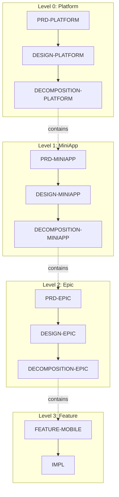

# Mobile SuperApp Kit Taxonomy

Canonical taxonomy for the Mobile SuperApp kit.

This guide defines what each artifact/code kind is at each hierarchy level, how it transforms into the next layer, how it traces to upstream IDs, and which files define templates/rules/examples.

## 4-Level Hierarchy



## Kinds by Level

### Level 0: Platform

#### PRD-PLATFORM

**Purpose**: Platform-wide product intent and requirements.

**Defines IDs**:
- Actors: `cpt-platform-actor-{slug}`
- Functional requirements: `cpt-platform-fr-{slug}`
- Non-functional requirements: `cpt-platform-nfr-{slug}`
- Use cases: `cpt-platform-usecase-{slug}`
- Constraints: `cpt-platform-constraint-{slug}`

**Transforms into**:
- **DESIGN-PLATFORM**: architecture decisions reference PRD FR/NFR IDs
- **PRD-MINIAPP**: MiniApp PRDs reference platform-level requirements

**Files**:
- Template: [artifacts/PRD-PLATFORM/template.md](../artifacts/PRD-PLATFORM/template.md)
- Rules: [artifacts/PRD-PLATFORM/rules.md](../artifacts/PRD-PLATFORM/rules.md)
- Checklist: [artifacts/PRD-PLATFORM/checklist.md](../artifacts/PRD-PLATFORM/checklist.md)

#### DESIGN-PLATFORM

**Purpose**: Platform-wide technical architecture.

**References upstream IDs**:
- PRD-PLATFORM FR/NFR IDs

**Defines IDs**:
- Principles: `cpt-platform-principle-{slug}`
- Constraints: `cpt-platform-constraint-{slug}`
- Components: `cpt-platform-component-{slug}`
- Modules: `cpt-platform-module-{slug}`
- Interfaces: `cpt-platform-interface-{slug}`

**Transforms into**:
- **DECOMPOSITION-PLATFORM**: MiniApps reference platform components
- **DESIGN-MINIAPP**: MiniApp designs inherit platform constraints

**Files**:
- Template: [artifacts/DESIGN-PLATFORM/template.md](../artifacts/DESIGN-PLATFORM/template.md)
- Rules: [artifacts/DESIGN-PLATFORM/rules.md](../artifacts/DESIGN-PLATFORM/rules.md)
- Checklist: [artifacts/DESIGN-PLATFORM/checklist.md](../artifacts/DESIGN-PLATFORM/checklist.md)

#### DECOMPOSITION-PLATFORM

**Purpose**: Break platform into MiniApps.

**Defines IDs**:
- MiniApps: `cpt-platform-miniapp-{slug}`
- Status tracker: `cpt-platform-status-overall`

**References upstream IDs**:
- PRD-PLATFORM FR/NFR IDs (coverage)
- DESIGN-PLATFORM component IDs

**Transforms into**:
- **PRD-MINIAPP**: Each MiniApp entry links to MiniApp PRD

**Files**:
- Template: [artifacts/DECOMPOSITION-PLATFORM/template.md](../artifacts/DECOMPOSITION-PLATFORM/template.md)
- Rules: [artifacts/DECOMPOSITION-PLATFORM/rules.md](../artifacts/DECOMPOSITION-PLATFORM/rules.md)
- Checklist: [artifacts/DECOMPOSITION-PLATFORM/checklist.md](../artifacts/DECOMPOSITION-PLATFORM/checklist.md)

---

### Level 1: MiniApp

#### PRD-MINIAPP

**Purpose**: MiniApp-level product requirements.

**References upstream IDs**:
- PRD-PLATFORM FR/NFR IDs (cascading requirements)
- DECOMPOSITION-PLATFORM MiniApp ID

**Defines IDs**:
- Actors: `cpt-{miniapp}-actor-{slug}`
- Functional requirements: `cpt-{miniapp}-fr-{slug}`
- Non-functional requirements: `cpt-{miniapp}-nfr-{slug}`
- Use cases: `cpt-{miniapp}-usecase-{slug}`

**Transforms into**:
- **DESIGN-MINIAPP**: MiniApp architecture
- **PRD-EPIC**: Epic PRDs reference MiniApp requirements

**Files**:
- Template: [artifacts/PRD-MINIAPP/template.md](../artifacts/PRD-MINIAPP/template.md)
- Rules: [artifacts/PRD-MINIAPP/rules.md](../artifacts/PRD-MINIAPP/rules.md)
- Checklist: [artifacts/PRD-MINIAPP/checklist.md](../artifacts/PRD-MINIAPP/checklist.md)

#### DESIGN-MINIAPP

**Purpose**: MiniApp technical architecture.

**References upstream IDs**:
- PRD-MINIAPP FR/NFR IDs
- DESIGN-PLATFORM component/module IDs

**Defines IDs**:
- Components: `cpt-{miniapp}-component-{slug}`
- ViewModels: `cpt-{miniapp}-viewmodel-{slug}`
- Repositories: `cpt-{miniapp}-repository-{slug}`
- Navigation: `cpt-{miniapp}-nav-{slug}`

**Transforms into**:
- **DECOMPOSITION-MINIAPP**: Epics reference MiniApp components
- **DESIGN-EPIC**: Epic designs inherit MiniApp patterns

**Files**:
- Template: [artifacts/DESIGN-MINIAPP/template.md](../artifacts/DESIGN-MINIAPP/template.md)
- Rules: [artifacts/DESIGN-MINIAPP/rules.md](../artifacts/DESIGN-MINIAPP/rules.md)
- Checklist: [artifacts/DESIGN-MINIAPP/checklist.md](../artifacts/DESIGN-MINIAPP/checklist.md)

#### DECOMPOSITION-MINIAPP

**Purpose**: Break MiniApp into Epics.

**Defines IDs**:
- Epics: `cpt-{miniapp}-epic-{slug}`
- Status tracker: `cpt-{miniapp}-status-overall`

**References upstream IDs**:
- PRD-MINIAPP FR/NFR IDs (coverage)
- DESIGN-MINIAPP component IDs

**Transforms into**:
- **PRD-EPIC**: Each Epic entry links to Epic PRD

**Files**:
- Template: [artifacts/DECOMPOSITION-MINIAPP/template.md](../artifacts/DECOMPOSITION-MINIAPP/template.md)
- Rules: [artifacts/DECOMPOSITION-MINIAPP/rules.md](../artifacts/DECOMPOSITION-MINIAPP/rules.md)
- Checklist: [artifacts/DECOMPOSITION-MINIAPP/checklist.md](../artifacts/DECOMPOSITION-MINIAPP/checklist.md)

---

### Level 2: Epic

#### PRD-EPIC

**Purpose**: Epic-level user requirements.

**References upstream IDs**:
- PRD-MINIAPP FR/NFR IDs (cascading)
- DECOMPOSITION-MINIAPP Epic ID

**Defines IDs**:
- User stories: `cpt-{miniapp}-{epic}-story-{slug}`
- Acceptance criteria: `cpt-{miniapp}-{epic}-ac-{slug}`

**Transforms into**:
- **DESIGN-EPIC**: Epic technical design
- **FEATURE-MOBILE**: Features reference Epic requirements

**Files**:
- Template: [artifacts/PRD-EPIC/template.md](../artifacts/PRD-EPIC/template.md)
- Rules: [artifacts/PRD-EPIC/rules.md](../artifacts/PRD-EPIC/rules.md)
- Checklist: [artifacts/PRD-EPIC/checklist.md](../artifacts/PRD-EPIC/checklist.md)

#### DESIGN-EPIC

**Purpose**: Epic technical architecture.

**References upstream IDs**:
- PRD-EPIC story/AC IDs
- DESIGN-MINIAPP component IDs

**Defines IDs**:
- Components: `cpt-{miniapp}-{epic}-component-{slug}`
- Sequences: `cpt-{miniapp}-{epic}-seq-{slug}`
- Data models: `cpt-{miniapp}-{epic}-model-{slug}`

**Transforms into**:
- **DECOMPOSITION-EPIC**: Features reference Epic components
- **FEATURE-MOBILE**: Feature designs use Epic architecture

**Files**:
- Template: [artifacts/DESIGN-EPIC/template.md](../artifacts/DESIGN-EPIC/template.md)
- Rules: [artifacts/DESIGN-EPIC/rules.md](../artifacts/DESIGN-EPIC/rules.md)
- Checklist: [artifacts/DESIGN-EPIC/checklist.md](../artifacts/DESIGN-EPIC/checklist.md)

#### DECOMPOSITION-EPIC

**Purpose**: Break Epic into Features.

**Defines IDs**:
- Features: `cpt-{miniapp}-{epic}-feature-{slug}`
- Status tracker: `cpt-{miniapp}-{epic}-status-overall`

**References upstream IDs**:
- PRD-EPIC story/AC IDs (coverage)
- DESIGN-EPIC component IDs

**Transforms into**:
- **FEATURE-MOBILE**: Each Feature entry links to Feature document

**Files**:
- Template: [artifacts/DECOMPOSITION-EPIC/template.md](../artifacts/DECOMPOSITION-EPIC/template.md)
- Rules: [artifacts/DECOMPOSITION-EPIC/rules.md](../artifacts/DECOMPOSITION-EPIC/rules.md)
- Checklist: [artifacts/DECOMPOSITION-EPIC/checklist.md](../artifacts/DECOMPOSITION-EPIC/checklist.md)

---

### Level 3: Feature

#### FEATURE-MOBILE

**Purpose**: Implementable behavior design with MVI pattern and platform-specific sections.

**References upstream IDs**:
- DECOMPOSITION-EPIC feature ID
- PRD-EPIC story/AC IDs
- DESIGN-EPIC component/sequence IDs
- Cascading: PRD-MINIAPP, PRD-PLATFORM FR IDs

**Defines IDs** (code-traceable kinds):
- Flow: `cpt-{miniapp}-flow-{feature-slug}-{slug}`
- Algorithm: `cpt-{miniapp}-algo-{feature-slug}-{slug}`
- State machine: `cpt-{miniapp}-state-{feature-slug}-{slug}`
- Definition-of-done: `cpt-{miniapp}-dod-{feature-slug}-{slug}`

**Mobile-specific sections**:
- MVI State/Intent/Effect definitions
- KMP implementation section
- Android (Compose) implementation section
- iOS (SwiftUI) implementation section
- Platform-specific acceptance criteria

**Transforms into**:
- **CODE**: Implement flows/algorithms/states in KMP/Android/iOS

**Traceability**:
- FEATURE IDs are referenced from code using scope markers: `@cpt-{kind}:{cpt-id}:p{N}`
- Block markers: `@cpt-begin:{cpt-id}:p{N}:inst-{local}` / `@cpt-end:...`

**Files**:
- Template: [artifacts/FEATURE-MOBILE/template.md](../artifacts/FEATURE-MOBILE/template.md)
- Rules: [artifacts/FEATURE-MOBILE/rules.md](../artifacts/FEATURE-MOBILE/rules.md)
- Checklist: [artifacts/FEATURE-MOBILE/checklist.md](../artifacts/FEATURE-MOBILE/checklist.md)

#### IMPL

**Purpose**: Implementation tracking document.

**Contains**:
- Code file mappings
- Implementation status per platform
- Test coverage references

**Files**:
- Template: [artifacts/IMPL/template.md](../artifacts/IMPL/template.md)
- Rules: [artifacts/IMPL/rules.md](../artifacts/IMPL/rules.md)
- Checklist: [artifacts/IMPL/checklist.md](../artifacts/IMPL/checklist.md)

---

### CODE

**Purpose**: The implementation layer validated against FEATURE IDs.

**Defines**:
- No new Cypilot IDs are defined in code. Code only references IDs that exist in artifacts.

**Platforms**:
- KMP (Kotlin Multiplatform): shared domain, data, presentation
- Android: Jetpack Compose UI
- iOS: SwiftUI views with KMP wrappers

**Traceability**:
- Mark code with Cypilot markers as specified in `{cypilot_path}/.core/requirements/traceability.md`

**Files**:
- Rules: [codebase/rules.md](../codebase/rules.md)
- Checklist: [codebase/checklist.md](../codebase/checklist.md)

---

## ID Pattern Summary

| Level | Kind | Pattern |
|-------|------|---------|
| Platform | FR | `cpt-platform-fr-{slug}` |
| Platform | NFR | `cpt-platform-nfr-{slug}` |
| Platform | Component | `cpt-platform-component-{slug}` |
| Platform | MiniApp | `cpt-platform-miniapp-{slug}` |
| MiniApp | FR | `cpt-{miniapp}-fr-{slug}` |
| MiniApp | Component | `cpt-{miniapp}-component-{slug}` |
| MiniApp | Epic | `cpt-{miniapp}-epic-{slug}` |
| Epic | Story | `cpt-{miniapp}-{epic}-story-{slug}` |
| Epic | Feature | `cpt-{miniapp}-{epic}-feature-{slug}` |
| Feature | Flow | `cpt-{miniapp}-flow-{feature}-{slug}` |
| Feature | Algo | `cpt-{miniapp}-algo-{feature}-{slug}` |
| Feature | State | `cpt-{miniapp}-state-{feature}-{slug}` |
| Feature | DoD | `cpt-{miniapp}-dod-{feature}-{slug}` |

---

## Cascading FR Traceability

Requirements cascade through all four levels:

```
cpt-platform-fr-offline-support
    ↓ references
cpt-learn-fr-offline-courses
    ↓ references
cpt-learn-course-catalog-story-cache-courses
    ↓ references
cpt-learn-flow-course-list-load-cached
    ↓ implemented by
@cpt-flow:cpt-learn-flow-course-list-load-cached:p1
```

Each level must maintain references to upstream requirements it implements.

---

## CLI Commands

### Validation

| Command | What it validates |
|---------|-------------------|
| `cpt validate` | All artifacts + cross-references + code markers |
| `cpt validate-kits` | Kit package integrity |
| `cpt validate-toc` | Table of contents correctness |

### Traceability & Search

| Command | What it does |
|---------|--------------|
| `cpt list-ids` | Lists all IDs across all levels |
| `cpt where-defined <id>` | Shows where an ID is defined |
| `cpt where-used <id>` | Shows where an ID is referenced |
| `cpt spec-coverage` | Measures code coverage by CDSL markers |
| `cpt info` | Shows Cypilot configuration |

---

## References

- [Code Quality Checklist](../codebase/checklist.md) — mobile code review criteria
- [Code Rules](../codebase/rules.md) — mobile code generation and validation rules
- [Quick Start](QUICKSTART.md) — getting started guide
